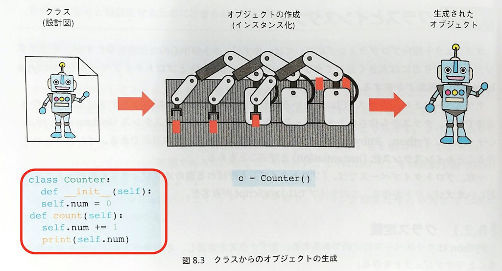
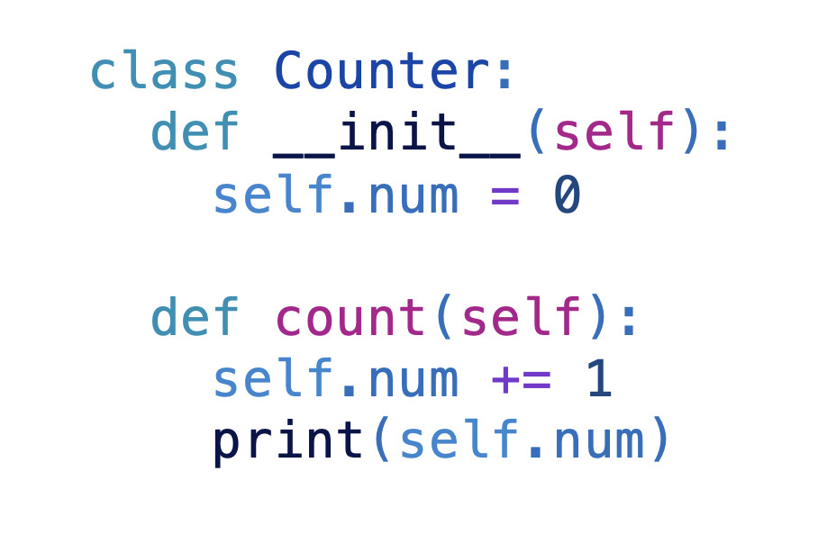
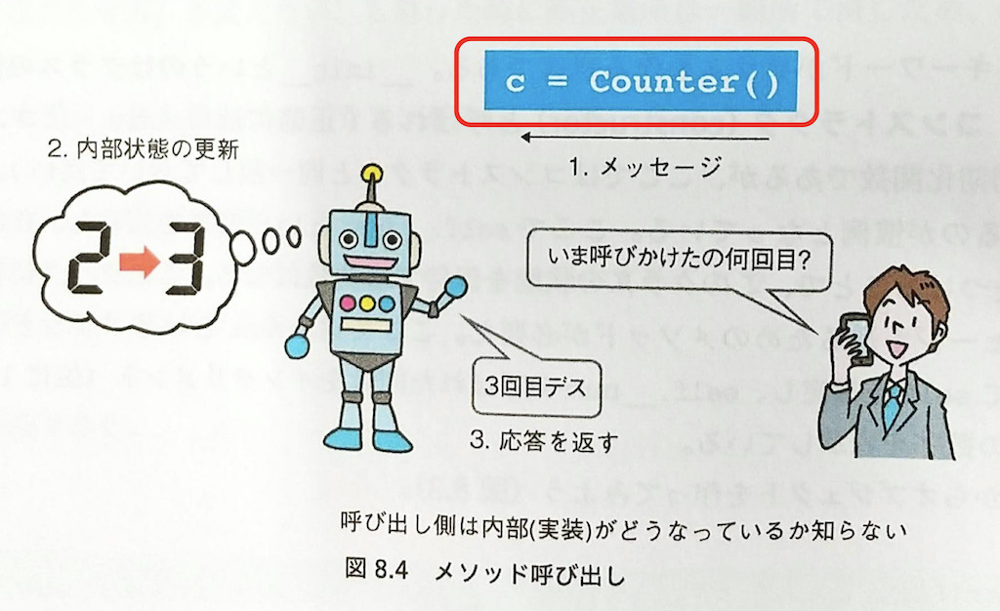
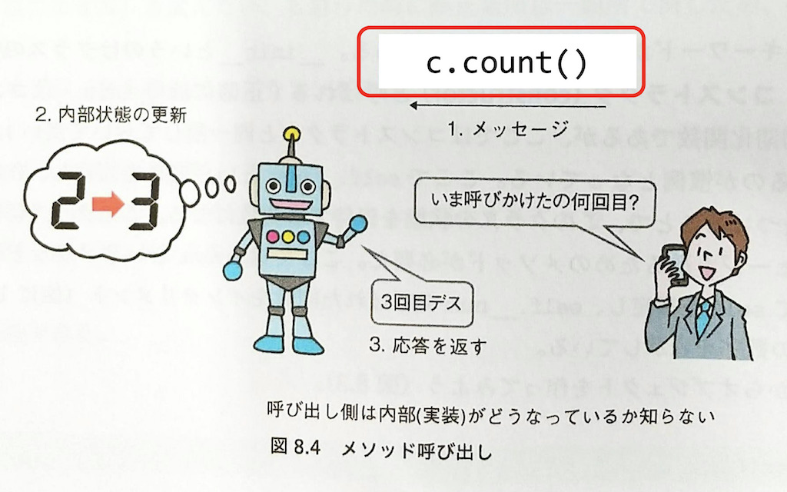
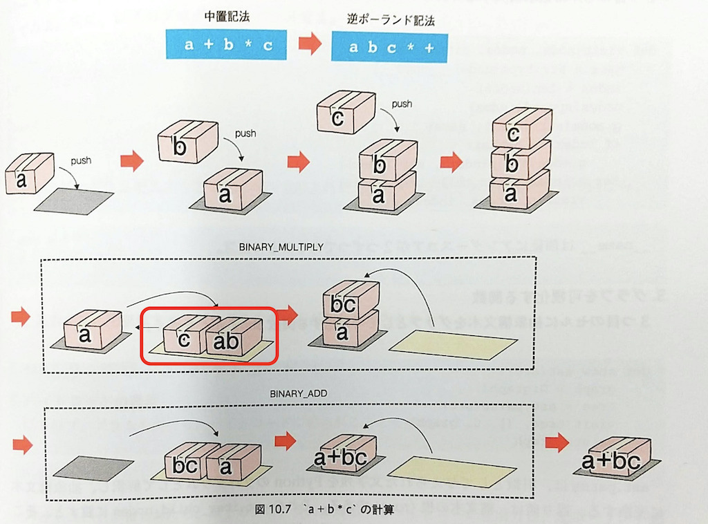
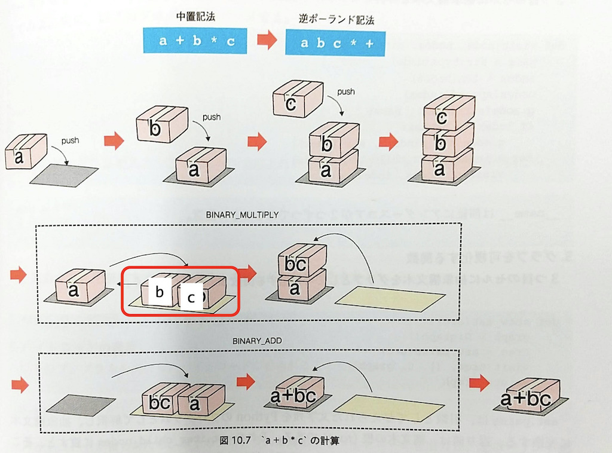
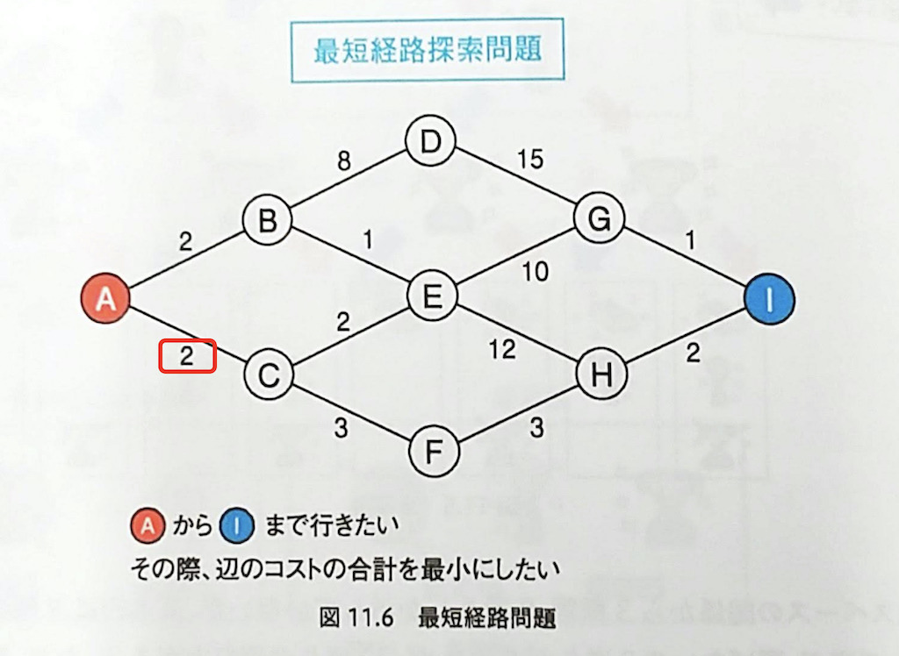
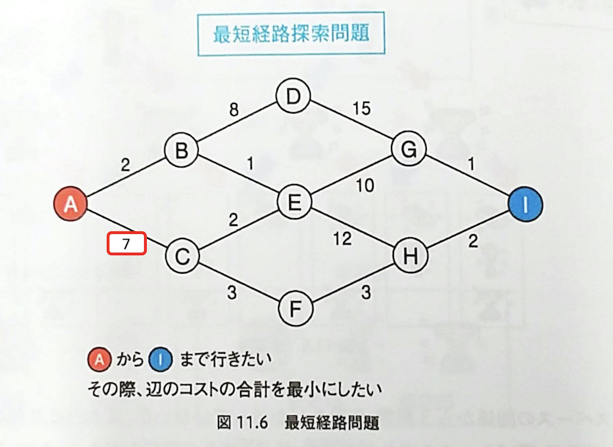
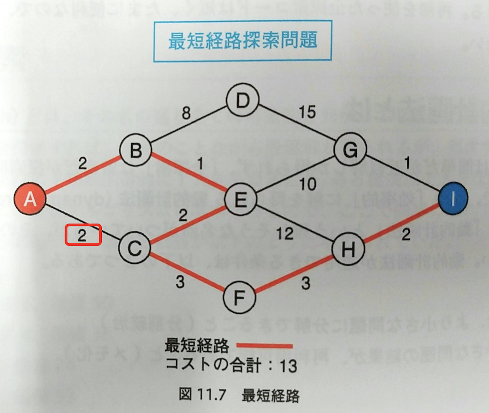
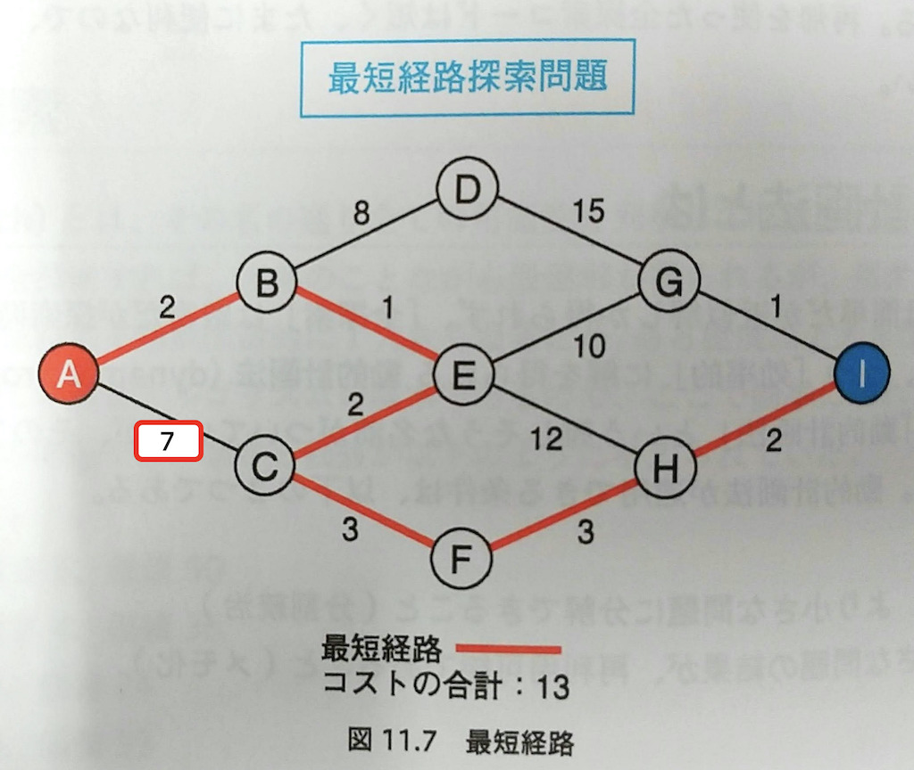

# 「ゼロから学ぶPythonプログラミング」訂正

注意深く執筆したつもりですが、現時点で以下のミスや修正点が見つかっております。ご迷惑をおかけして申し訳ありません。

他に誤りや修正すべき点を見つけた方は、[GitHubのIssue](https://github.com/kaityo256/python_zero/issues)にてご指摘いただければ幸いです。

最終更新日：2021年1月22日

| ページ番号 | 誤 | 正 |
| ---  | --- | --- |
| p. 10 | 「2. 五芒星の描画」のコードの2行目  `draw = ImageDraw.raw(im)` |   `draw = ImageDraw.raw(img)`|
| p. 66 | 12行目  「8ビットが0でない」 |  「8ビット**目**が0でない」 |
| p. 124| 図8.3のクラスのコードのインデントが不正。   | 正しいインデントは以下の通り。  |
| p. 124| 図8.4のメッセージが「`c = Counter()`」   | 正しくは`c.count()`   |
| p. 161| 図10.7のBINARY_MULTIPLYの箱のラベルが誤っている   | 正しくは以下の通り。   |
| p. 174| 図11.6のAとCの間のコストが2  |AとCの間のコストは7   |
| p. 174| 図11.7のAとCの間のコストが2  |AとCの間のコストは7   |
| p. 188| 「random.randint」から2行目 「これは6面サイコロを10回ふることを」|  「これは6面サイコロを**5**回ふることを」
